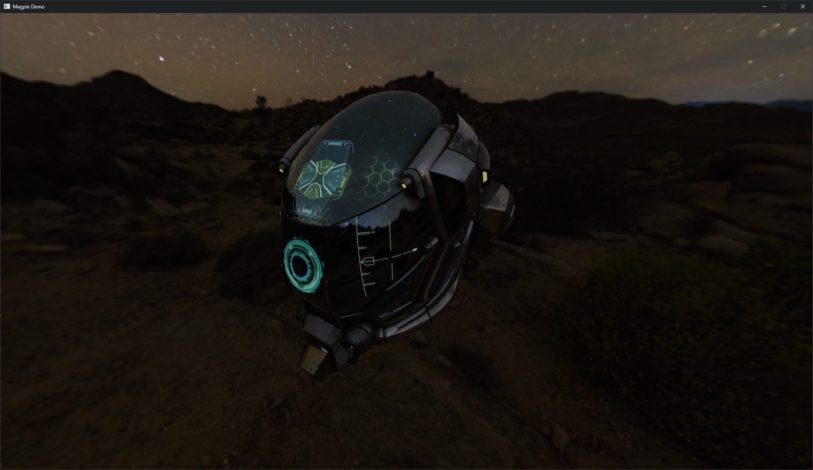
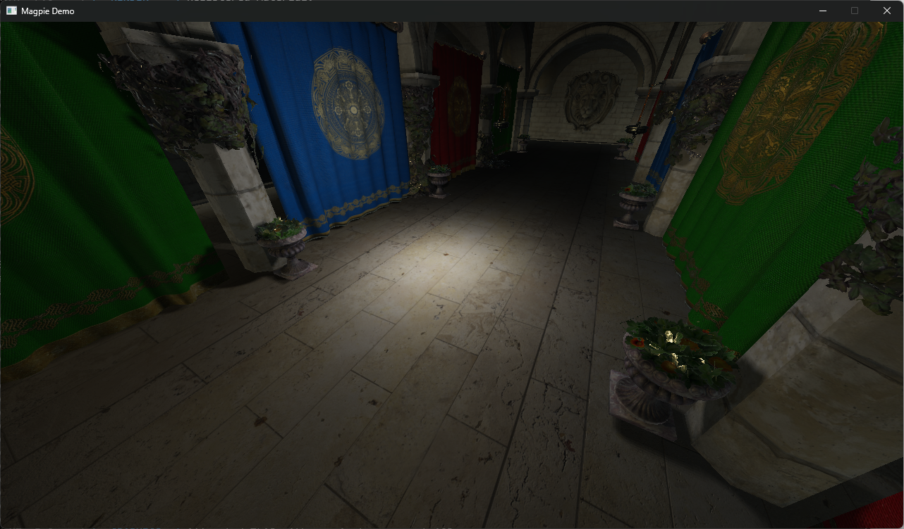

# Magpie

**Magpie** is primarily a Vulkan renderer (though it's turning into more of a game engine (-ish, closer to a more developed framework) as I add more features I'm randomly interested in) written in pure C.




TODO: add more images :p


## About the Project
Basically, this is a testing ground for whatever programming project I want to try at any given point. I hope maybe this project helps someone else. Ask me anything!

Yes, it's over-engineered for a solo project, but I enjoy good code. No guarantees on quality though, I'm a second-year CS student. Most of this code is probably bad, some of it is maybe good :).

!I also hate that I have to clarify that none of this is vibecoded (yes I talk to myself via comments get over it, though some may be a bit vulgar). This is actually something I care about, and put time into. Check the commit history if you don't believe me.

This isn't my first Vulkan or game engine project. If you look into the repository's history, it's gone through about 3-4 seperate re-writes (the original version, "Lilythorn" I accidentally wiped from the history entirely, oops...), and even then it was initially based off of my (very crudely written) [Wyvern](https://github.com/kryzp/wyvern) game engine which I made for my NEA all the way back in Year 13 for my A-Levels.

### Philosophy
Don't sacrifice blurriness and lag for a nicer still-image. 4x MSAA for main render path.


### Resources Used
- Real Time Rendering 4th Edition (i have the physical book it's genuinely awesome)
- Game Engine Architecture 3rd Edition
  - I've used this more for structuring the engine as a whole, it doesn't focus on graphics as much, but I've taken a lot from it and I'd recommend it to anyone learning how to make a game engine, or renderer.
- Vulkan Guide

---

## Notable Features
- **True Hot-Code Reloading** for everything outside of `/os/` (app code written to DLL)
- **Render Graph** that handles resource management, pipeline barriers, and synchronization
- **Bindless Resource Design**
- **GPU Driven Rendering:** bindless materials and meshes (global vertex buffer, vertex pulling, etc.)
- **Image-Based Lighting** (IBL)
- **Advanced glTF 2.0 material support** transmission, volume, specular, clearcoat, sheen, iridescence, etc.
- **Compute Frustum Culling**
- **Indirect Forward Rendering**
- **Point Lights** with compute-culled shadow-mapping
- **Right-Handed Z-up Coordinates** as it SHOULD be
- **Async Generic Asset Streaming**
- **Asset Hot-Reloading**
- **Arena Memory Allocation System**
- **Page-Allocated Geometry Data** in the render scene allowing for efficient mesh data streaming in and out
- **Lockless (almost) fiber-based job system** with an even lower-latency spin mode
- **Controller Support**
- **3D Audio**
- **Debug Rendering** lines, circles, spheres, AABB, OBB, crosses, etc.
- **GPU Profiler**
- **Modular Entity System**
- **Logging System** with levels, channels (+ sub channels), file output, deduplication, etc.
- **Raytraced Static Irradiance Probes**
- **Skeletal Animation Support**
- **Scripting Integration** with all top-level systems (using Lua).
- **Naughty Dog-Style Frame System** hard to explain, essentially frames are packed into "frame params" which are then sent to the render system, which allows for far more synchronisation and performance.
- **Frame Interpolation** based on the highly inluential https://gafferongames.com/post/fix_your_timestep/ article, integrated with the Naughty Dog frame params as listed above.


## Roadmap

### Planned Features (in rough order of what's next)
- Flesh out the animation system, make it more intergrated.
- Physically Based Bloom
- ImGui Integration (C bindings)
- SSAO (horizon-based none of that random hemisphere stuff)
- Cascaded Shadow Mapping (CSM)
- Advanced Material Rendering
  - [ ] Transmission
  - [ ] Specular
  - [x] Clearcoat
  - [ ] Sheen
  - [ ] Iridescence
  - [x] Unlit Materials
- Basic Sorted Forward Transparency
- Forward+ Light Clustering
- Advanced Reflections + Reflective Materials (e.g: Mirrors, SSR, Multiple reflection probes)
- Text / Font Rendering
- Multi-Threaded CPU profiler integrated with the Job system (difficult due to fibers, as there is no guarantee a job will start and end on the same thread)
- Visualisation for Profilers (CPU & GPU)
- Dynamic Irradiance Probes which automatically reposition themselves
- 2D Batch Quad Renderer (basically the SpriteBatch from XNA/FNA/MonoGame)
- UI System (needs 2D batch renderer)
- Compositive Post Processing Pipeline
- Refraction


### Non-Graphics Planned Features (general engine stuff that interests me)
- Custom (simple) physics engine
- Complete the entity system
- Cutscenes!


### Mini Project Ideas
- Volumetrics (Clouds, Smoke, etc.)
- Grass / Fur / Hair Rendering
- Realistic Ocean water rendering based on FFT
- Terrain Generator based on No Man's Sky GDC Talk
- Compute particles based on Naughty Dog's *The Last of Us Part II* SigGraph 2020 Talk
- *Half-Life: Alyx* style reticle / gun scope effect (scope is only visible through the front holographic "lens", probably done through stencil magic)

---

## Architecture
The codebase is split into a tiered system to make development easier and more compartmentalized. This is akin to the Source engine (Tier0, Tier1, ...) or the Decima Engine (OS, PIGS, ...), though a little more granular.


### Namespaces
Each layer follows a strict namespace system. Since this is C, I'm referring to typically 2-3 (rarely 4, sometimes 1) capitalized characters in front of each exposed type or function in the layer indicating where it comes from. This prevents naming collisions and makes code much easier to read. `/core/` is the exception to this rule, and has no namespace for brevity, as it contains common types used throughout the codebase (maths functions, `typedef`s for unsigned types, etc.).

`/app/` and `/editor/` don't have namespaces as they aren't "engine" code, they're what you'd call "game" code. I just don't use a namespace for them by convention.


### Unity Build
Both headers and source are `#include`'d in a single compilation unit. This simplifies compilation to just compiling a single file (+ external libraries if needed) which is much, much faster than compiling traditionally. It means no more incremental builds (but when were those ever useful anyway eh?), and it also means you don't need to bother with `#include`s, which is nice.

Headers exist to document the API from a higher level because it's nice to be able to read everything at a glance.


### The Layer Organisation
Layers strictly only propogate one-way, that is to say, a layer *A* that uses functionality by layer *B* will never have it's own functionality used by layer *B*. This means that circular dependencies are essentially impossible, and terrible architecture is usually pretty obvious when you realise you need to do some pretty sketchy stuff to get something to work. That being said, *dependency injection* is perfectly fine. Callbacks are used all over the codebase.

You can intuitively see how some layers clearly depend on others, for instance, *rendering* needs to have access to low level `/graphics/` operations, but also *assets* such as textures and models (which ultimately also need to use the `/graphics/` layer).

However, it is still ultimately a monolithic build. For a while I considered going the Machinery / Source Engine approach of complete modularity where every engine sub-system gets split apart into a DLL that then gets linked up at runtime, but it's a lot of work for basically no gain. I still might, if only to try something new out, which is the point of the this whole project anyway, but it's not a top priority right now. If I do, it really won't be a problem since layers have pretty well defined API's anyway, it'd just be a lot of groundwork / boilerplate that I don't wanna do right now.

The hierarchy of layers is visible via the order of `#include`'s in `magpie.c`.


### Memory Arenas
To simplify memory management in C I use a thing called a "memory arena" for pretty much anything. I'm not going to go into why because [this](https://www.youtube.com/watch?v=TZ5a3gCCZYo) talk by Ryan Fleury explains it way better. Essentially, they let you "group" allocations and formalize the idea of a "scope" for some object.

The one major downside with arenas is when it comes to dealing with things that might not have an actual fixed "scope" in the code since you can't remove things from the middle of the arena (at least, not without moving a ton of memory around which would be pretty expensive). For instance entities that can be added and removed at any time. I fix this by making use of freelists where possible.


### Job System
The job system is effectively at the core of the project. It is a fiber-based job system based off-of the pioneering work of Naughty Dog in their presentation "Parallelizing the Naughty Dog by Christian Gyrling". It's pretty complicated but the basic idea is that using a naiive job queue is that when a job dispatches more jobs and waits on them, the thread running that job stalls when it could be working! This can get even worse, when in some cases it can straight up lead to a deadlock as there might not be any free thread to complete the child job!

To fix this problem, we turn to a thing called a "fiber". The special thing about fibers is that they maintain their own call stack, which allows us to context-switch between any job at any time we want. Therefore, every time we "wait" at a counter (renamed - "Yield" because it's more apt) the fiber running that job context switches to a different job, and once all the jobs that the counter is waiting on are completed, then we resume that job by context-switching back into it.

If you're more curious I wrote a blog post about my implementation approach [here](https://kryzp.github.io/posts/fiber-job-system/).


### Assets
I'm actually pretty proud of this system! Assets are loaded entirely asynchronously since they're integrated with the job system. However, that leads to a problem, which is that an asset actually goes through multiple stages until it's considered "ready". In a naiive asset system, you typically have a single `Load()` function that handles everything from finding the file on the disk, to load it into memory, and potentally uploading to the GPU. That's pretty terrible because you have to wait for the entire asset to load in before moving on to the next one, when you could be loading multiple in parallel.

You can't just parallelize the whole thing because while loading an asset into memory is super simple, when it comes to things like uploading onto the GPU it's not so simple and we want to minimize the number of command buffers we use / submit. Therefore, I split asset loading into four stages:

1. The CPU Stage: This is where we find the file in memory, load it in, and allocate some temporary memory for it. We haven't modified the actual asset record yet. For example, loading in pixel data from a texture file.
2. The Alloc / Realloc Stage. This is where we actually move that temporary data into the asset and allocate any resources. This has to be seperate from the CPU stage as memory allocation on the main asset arena has to be synchronised between jobs. In the CPU stage each job gets its own arena so there's never any contention!!
3. The GPU Stage. This is where we upload the data onto the GPU, exposing a command buffer and staging buffer which can be used.
4. The Cleanup Stage. Any temporary data that was allocated in previous stages can be cleaned up here. Only really necessary for external API's (e.g: cleaning up texture data from `stbi`) because we use arenas for everything internally anyway.

Essentially, we parallelize the CPU stage, and try to record as much instructions onto the command buffer in the GPU stage before submitting.

Hooking it up was more "awkward" than "hard" necessarily but it works and that's what matters. It leads to some uncomfortable code when allocating extra data per-asset because we have to do a deep copy of that data (anything allocated using `ctx->scope` in the cpu stage is impermanent) once it gets to the alloc stage but that's fine.

The asset system also supports fancy things like hot-reloading of assets which was also harder than I initially assumed because some assets, like shaders or models, also have dependencies. So, we have to watch those for modifications as well. Fun stuff!


### The Entity System
I really dislike entity component systems with a viceral, primal, gut-wrenching hatred, but inheritance-based ones suck as well, so we go with the best solution in my opinion: you split entity behaviours into just... structs.

You just call to them for shared functionality (imagine - NPC's like shopkeepers, raiders, etc... all have some shared functionality (maybe you can talk to them, or they have an opinion of you, etc...) so you just move it out into a struct. Simple as!). Of course each entity has unique data (otherwise your game would be a little more exciting then staring at a mountain erode via rainfall) and it's easy as pie to do with this system. Best of both worlds!

It's kinda like a mega-structure entity approach except it doesn't feel like someone stabbing you 591224 times in the pancreas every time you try to add new behaviour into your three trillion line header file and find that you've yet again hit a naming conflict, and have become lost entirely. If you want physics, ask the physics engine for a handle and then use it. If you want audio, AI, rendering, all the same. An entity is just a glorified function call anyway.

I use some fancy X-Macro magic to streamline the process, like automatically generating a type description per-entity.

Everything an entity needs to inform decisions (pointers to other systems, the world, etc...) all just gets passed as a single context struct to it's tick functions.


### Rendering Structure
Rendering is fundamentally abstracted into what should be three layers, but is only two right now:

1. **The Vulkan abstraction layer (`/graphics/`)**: Makes up the bulk of the graphics layer. Handles synchronization, resource management, etc. GPU resources are assigned handles (keys) by the graphics device, and only get resolved when they're used. Pretty much all high-level interactions with Vulkan either go through the device or command buffer (which has to get submitted to the device anyway).
2. **The Scene abstraction layer (WIP, currently in `/render/`)**: Manages meshes, materials, and lights.
3. **The Rendering abstraction layer (`/render/`)**: Consists of a render graph abstraction and (generally) stateless render stage code, such as the culling, geometry, and lighting stages.

Right now, `/graphics/` and `/render/` are a little more "intertwined" than they should be simply out of convenience because we're only dealing with Vulkan. E.g: `VK_FORMAT_...` technically shouldn't be in `/render/` (or any Vulkan stuff for that matter) as it's a graphics-backend thing, so there should be some kind of universal `GFX_Format` that backends map to their internal API versions, but that's so much code to maintain for zero benefit.


## Scripting
I've implemented a Lua-based scripting system that lies at a pretty low level that allows all layers above it to "hook" into it. I think this is kinda where the layer architecture shines. Anyway it's not the greatest thing in the world but it gets the job done. It's not intended to be used for engine behaviours but when I make games on the side to test out the engine there's often stuff like cutscenes or one-off interactions (idk, talking to a specific shopkeeper) that are just a pain in the ass to do in the C code due to all the systems that have to work together to make it happen, so having a centralized scripting system that lets you just access all systems globally in a contained space is just a really nice QoL feature to have.


### Hot-Code Reloading
The actual implementation of this is simple in theory. We pass a V-Table `OS_API` which can be used by `app.dll` to make OS-level calls from the main executable. For instance, if we wanna allocate memory, we have to do it through this V-Table because otherwise the memory allocated is attributed to the DLL and thus lost on hot reload. Unfortunately, being able to hot reload the state at any point means there are some things that get tricky, mostly things related to global data. However, it can be (mostly) fixed by:
1. Using as little globally-accessible data as possible.
2. Re-setting it whenever we hot reload.

The reason this is so "easy" to implement is because we manage all the memory ourselves in large chunks (thank you arenas). If we were dealing with C++ this would become a whole ass project on it's own because we'd have to hook into any and all smaller memory allocations in the program, and would be so clunky and awkward and slow to use that it really wouldn't be worth it. Maybe some special gameplay code could be compiled to a seperate dynamic library but certainly not to the extent I do here.

`/os/` ultimately doesn't rely on the app at all or any layers "higher" than `/core/`, `/input/`, `/io/` and `/log/`, it just makes some assumptions about specific functions inside the DLL (namely, `AppXXX`) which mostly all take in the context pointer (generic, just some allocated data returned by `AppInit`) alongside maybe some other data (such as input, in the case of `AppTick`).

Note: right now hot-reloading actually doesn't work because of `miniaudio`, which crashes when I try hot reload. I need to figure out why that's happening, I might have to modify miniaudio a little for my purposes if it's a problem with global data. If you remove the audio system from the loop it works like a treat.

```
+--------------------------------------------------+
|  magpie_win32.exe                                |
|                                                  |
|  All OS primitives, job scheduler, etc...        |
|  Exposes API via function pointer table          |
|                                                  |
|  W32_RootJobEntry  --> AppInit(...)              |
|  W32_FrameJobEntry --> AppTick(...)              |
+--------------------------------------------------+
              |
              |  Passes API Table
              V
+--------------------------------------------------+
|  app.dll                                         |
|                                                  |
|  AppInit(...)                                    |
|  AppTick(...)                                    |
|  ...                                             |
|                                                  |
|  Calls jobs via: api->JobKick(...)               |
+--------------------------------------------------+
```


### Formatting
Files in each namespace begin with the full name of the namespace followed by an underscore, and include guards are just the capitalized name of the file. "Sub-layers", like `/os/win32/`, `/render/pass/` or `/asset/serializer/`, don't follow any strict naming organisation apart from also sharing the same namespace as the parent layer, though I'd like to come to some kind of standard eventually.

All structs and enums are typedef'd (sorry Torvalds) to improve readability. However, avoid using misleading typedefs:

```C
typedef SomeOtherThing *MyDataType;
```

This is TERRIBLE, EVIL, and puppies (or kittens, your choice) GENUINELY DIE when you do this. Usually you can get away with doing something different, and in cases where it is necessary make it clear that it's a weird opaque type (e.g: if it's a pointer make it clear it's a pointer, I cannot tell you how many times I used an API and midway through I realised I was passing around pointers to pointers and not just regular structs).

Macros follow the naming convention of whatever makes the most sense: if it's meant to act like a function use `PascalCase`, if it's a constant use `SCREAMING_SNAKE_CASE`, etc.

Other than that I'm pretty lax on formatting, there's entire systems that are just formatted differently because I was experimenting, it's no big deal because I'm the only person working on this project. But in general a sub-system / layer should follow the same formatting even if it might be different from the other layers (though even this isn't really enforced... at least keep the formatting the same in a single file! that's the bare minimum I think!!!).


### Cool Stuff
Interesting files that you might wanna have a look at if you're just starting with the codebase.

- `app` DLL Entry Point
- `core/core_arena.*`
- `os/*` OS API
- `os/win32/*` Job System, Logging and Win32 Platform layer
- `render/render_graph.*`
- `render/render_scene.*`
- `asset/asset_manager.*`
- `asset/serializer/asset_serializer_model.c`
- `graphics/graphics_device` Low-Level Vulkan abstraction


## QnA

> Where's the cool engine UI?????

Not a game engine. And even if it was, I'd only make the editor UI after deciding on the game.


> Can I use this to make my own games?!

Don't. I mean, you can, and I'm not gonna stop you. But don't (coming from a place of love). It's unstable and constantly changing. I mostly made it for my own projects and games and I modify it however I see fit. I don't intend to build it for someone else. If you really want to probably just cut out sections of it and make your own fork, then understand you can never pull again without breaking your project.


## External Libraries
This project is built upon the shoulders of- yeah you've heard it all before. All external libraries are found in `ext/`

- SDL3
- Vulkan + Vulkan Memory Allocator + Volk
- Slang Compiler
- cgltf
- ImGui
- miniaudio
- STB headers
- Lua
