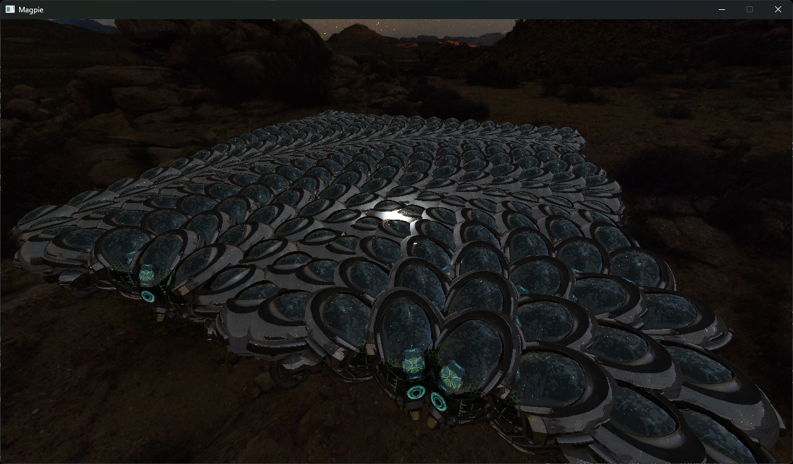

# Magpie

It's a (vulkan) renderer written in C++, with some other features added on (basically a testing ground for whatever programming project I wanna try at any point).

I hope maybe this project helps someone else. Feel free to use any of the code in any projects as long as you credit me. No gurantees on quality though. Some of this code is (probably) bad, some of it is (maybe) good ;).

### Pictures
TODO (It looks super cool and awesome trust me).

### Notable Features
	- Right-handed Z-up coordinates (as it SHOULD be)
	- Fully bindless + BDA
	- Vulkan hardware abstraction layer
	- IBL (Image-Based Lighting)
	- GPU Driven Rendering
	- Material system
	- Mesh merging
	- Compute Frustum Culling
	- Render Graph that handles resource management, pipeline barriers and synchronization inspired by "Render graphs and Vulkan — a deep dive" and "FrameGraph: Extensible Rendering Architecture in Frostbite"
	- Indirect Deferred Rendering
	- Multi-Threaded (almost) lockless fiber-based job system (allowing for job yielding!!), with low-latency spin mode. Input and OS-events are handled on the main thread while the main game loop runs on a seperate "root".
	- Multi-Threaded CPU profiler integrated with job system

### Ideas / Todo List
	- More sophisticated debug logging / tracing system
	- Switch to using timeline semaphores instead of fences
	- ImGui Integration
	- GPU profiler
	- ImGui visualisation for profilers
	- Volumetrics
	- Irradiance probes
	- Reflective mirrors
	- Bone / Joint based animation
	- Fur / Hair Rendering
	- Text / UI Rendering
	- Realistic ocean water based on FFT
	- Terrain Generator based on No Man's Sky GDC Talk
	- Compositive Post Processing Pipeline
	- Compute particles based on Naughty Dog's Last of Us 2 SigGraph 2020 Talk
	- Hybrid Clustered Deferred + Forward Rendering (for transparency)
	- Refraction
	- Half Life: Alyx style reticle / gun scope effect (scope is only visible through the front holographic "lens", probably done through stencil magic)
