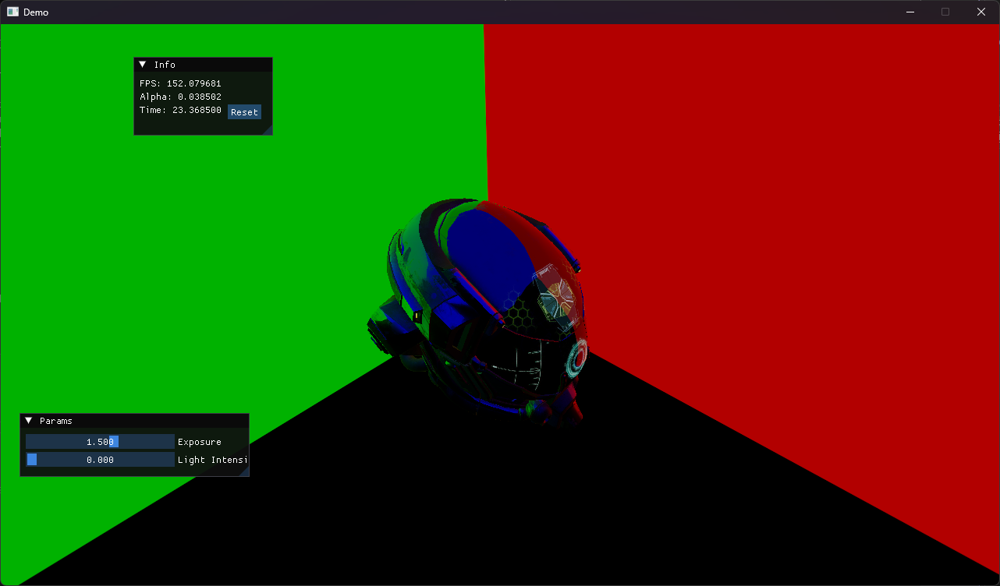

# Magpie

Vulkan renderer written in C++, with some other features added on (basically a testing ground for whatever programming project I wanna try at any point).

I hope maybe this project helps someone else. Feel free to use any of the code in any projects as long as you credit me.

No gurantees on quality though, I'm still a student. Most of this code is probably bad, some of it is maybe good :).

### Interesting Parts
- `app`
- `core/memory_arena`
- `core/scratch`
- `core/class_db`
- `platform/*`
- `job/*`
- `assets/*`
- `graphics/render_graph`
- `graphics/render_scene`
- `graphics/device`
- `graphics/renderers/*`
- `res/frustum_culling`

### Features
- Render Graph that handles resource management, pipeline barriers and synchronization
- Modern bindless resource design
- GPU Driven Rendering: Bindless materials and meshes (global vertex buffer, vertex pulling, etc...)
- IBL (Image-Based Lighting)
- Compute Frustum Culling
- Indirect Deferred Rendering
- Point Lights with compute-culled shadow-mapping
- ImGui Integration
- Right-handed Z-up coordinates (as it SHOULD be)
- Async Asset Streaming (integrated with job system)
- Asset Hot-Reloading
- Arena Memory Allocation System
- Page-allocated Render Scene
- High-performance (almost) lockless fiber-based job system, with low-latency spin mode.
- RTTI macro system allowing for type introspection and other cool stuff like iterating over fields
- Controller support I guess :p
- Timeline semaphores for synchronization (except for swapchain, that still has to use binary ones...)
- Custom intermediary file format for shaders to streamline asset loading
- Audio because I was bored and wanted to do something else
- Debug Rendering (lines, circles, spheres, AABB, etc...)

### TODO
- Text / Font rendering
- Custom (Arena-Based) Container Library
- More sophisticated debug logging / tracing system
- GPU profiler
- Multi-Threaded CPU profiler integrated with job system
- ImGui visualisation for profilers
- Volumetrics
- Irradiance probes with spherical harmonics
- Reflective mirrors
- Bone / Joint based animation
- Fur / Hair Rendering
- UI system
- Realistic ocean water based on FFT
- Terrain Generator based on No Man's Sky GDC Talk
- Compositive Post Processing Pipeline
- Compute particles based on Naughty Dog's Last of Us 2 SigGraph 2020 Talk
- Hybrid Clustered Deferred + Forward Rendering (for transparency)
- Refraction
- Half Life: Alyx style reticle / gun scope effect (scope is only visible through the front holographic "lens", probably done through stencil magic)
- Shader Permutations?

### Pictures

